# 2) Instalação do Node.js

Hoje em dia o Node.js é um sistema bem leve e de fácil instalação, na maioria dos casos basta você acessar o site oficial[[01]](https://nodejs.org/en/download/) e baixar o arquivo para seu sistema operacional.

Veremos aqui as formas atuais e mais simples de instalar, além de conhecer os dois principais gerenciadores de versão disponível.

<a id="getting-ready-macos"></a>
## macOS

Para instalar no macOS você pode simplesmente acessar o site oficial[[01]](https://nodejs.org/en/download/), baixar o instalador para macOS e seguir os passos para instalação do `.pkg`.

[carece de screenshot]

<a id="getting-ready-windows"></a>
## Windows

Para instalar no Windows você pode simplesmente acessar o site oficial[[01]](https://nodejs.org/en/download/), baixar o instalador para Windows e seguir os passos.

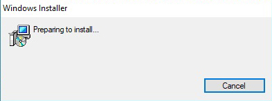
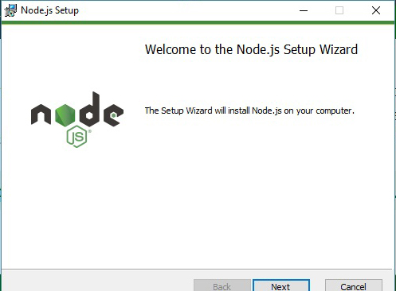
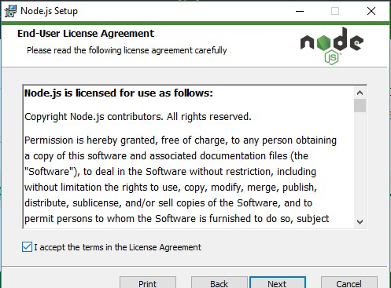
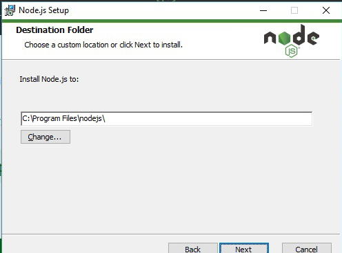
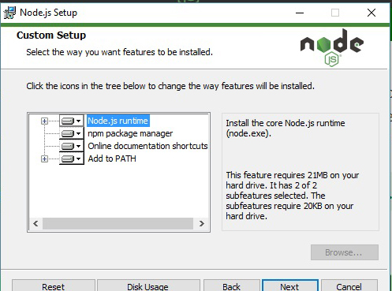
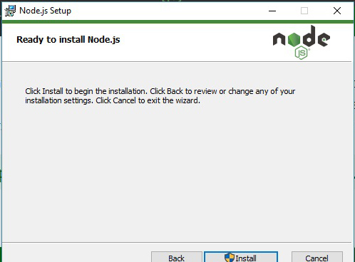
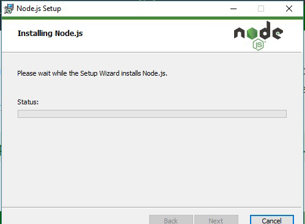
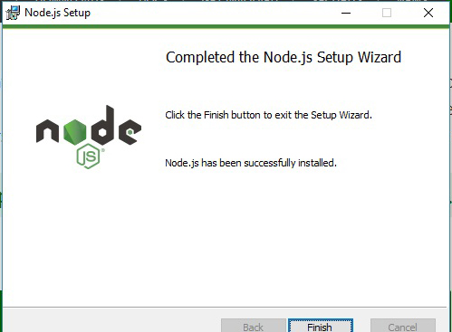
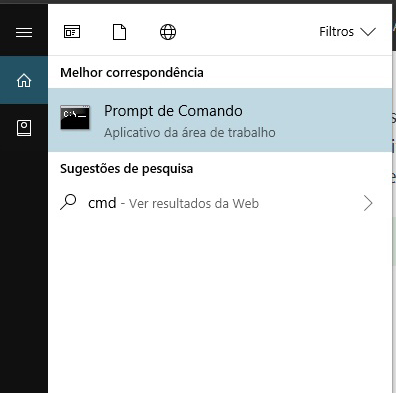
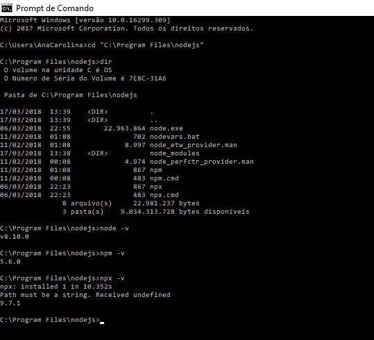

<a id="getting-ready-linux"></a>
## Linux

Para instalar no Linux você pode baixar os binários direto do site oficial site oficial[[01]](https://nodejs.org/en/download/):

```shell
wget https://nodejs.org/dist/v8.10.0/node-v8.10.0-linux-x64.tar.xz
tar -xvf node-v8.10.0-linux-x64.tar.xz
```

E criar um link simbólico para os arquivos dentro de `bin/`:

```shell
sudo ln -s /opt/node-v8.10.0-linux-x64/bin/node /usr/bin/
sudo ln -s /opt/node-v8.10.0-linux-x64/bin/npm /usr/bin/
sudo ln -s /opt/node-v8.10.0-linux-x64/bin/npx /usr/bin/
```

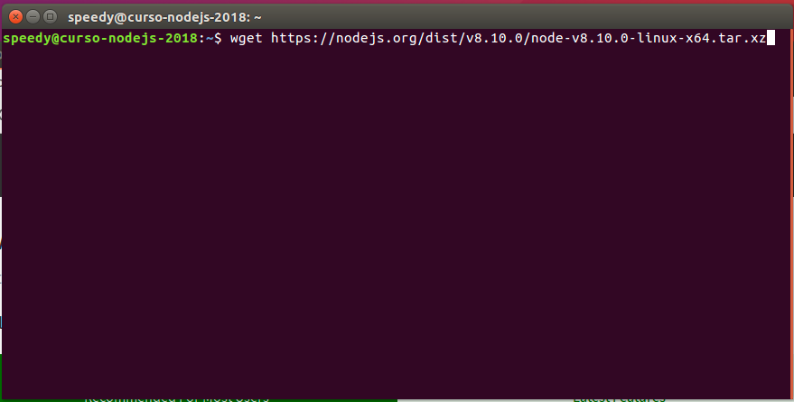
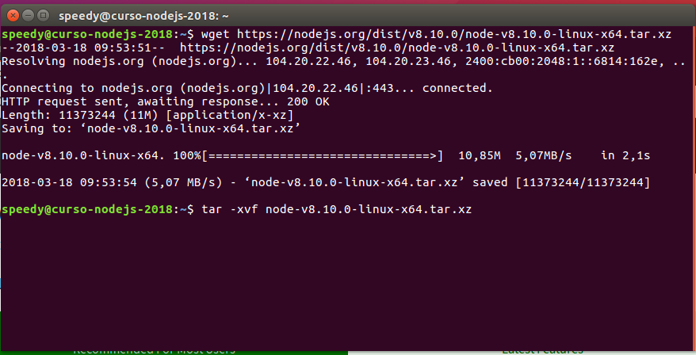
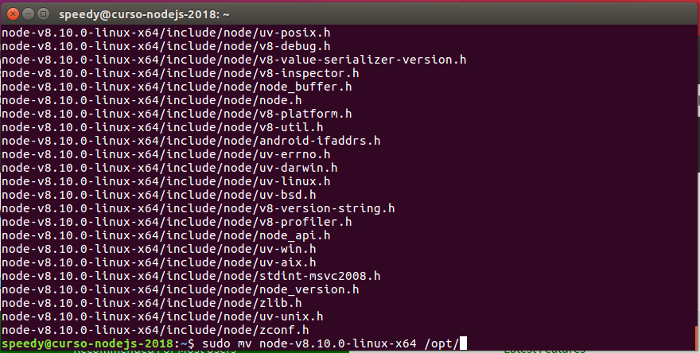
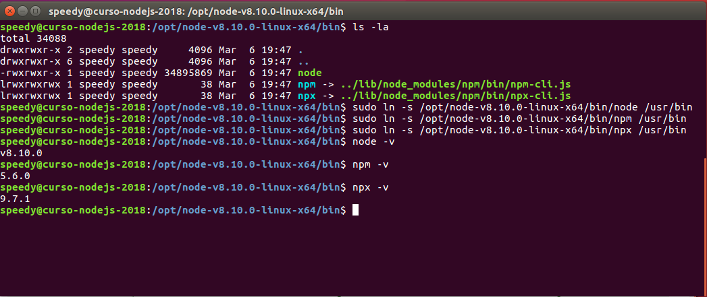

## Gerenciador de versão

Caso você queira trabalhar com múltiplas versões do Node.js e/ou atualizar de maneira segura e rápida sua versão local, você pode usar um *gerenciador de versão*.

Os mais populares são: `nvm`[[02]](https://github.com/creationix/nvm) e `nvm-windows`[[03]](https://github.com/coreybutler/nvm-windows), ambos projetos são open source mas não tem nada a ver um com o outro, com excessão clara de seu nome[[04]](https://github.com/coreybutler/nvm-windows#this-is-not-the-same-thing-as-nvm-which-is-a-completely-separate-project-for-maclinux-only).

### nvm

O nvm (*Node Version Management*), é desenvolvido para sistemas *UNIX* (*macOS* e *Linux*).

Você pode executar o seguinte comando para instalar o `nvm`:
```shell
wget -qO- https://raw.githubusercontent.com/creationix/nvm/v0.33.8/install.sh | bash
```

Assim que você executar esse comando, ele irá baixar os binários do nvm e colocar no path `~/.nvm`, além de adicionar no seu arquivo de profile do terminal (`~/.bash_profile`, `~/.zshrc`, `~/.profile`, or `~/.bashrc`), um comando para executar ele nas próximas vezes que você abrir o terminal.

Para executar o nvm:
```shell
. ~/.nvm/nvm.sh
```

Agora, para instalar uma versão do Node.js:
```shell
nvm install v8.10.0
```

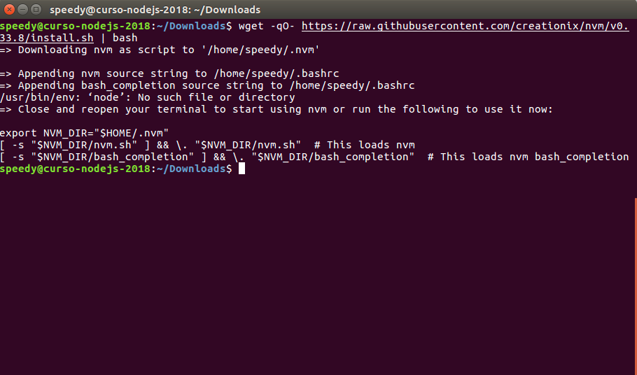
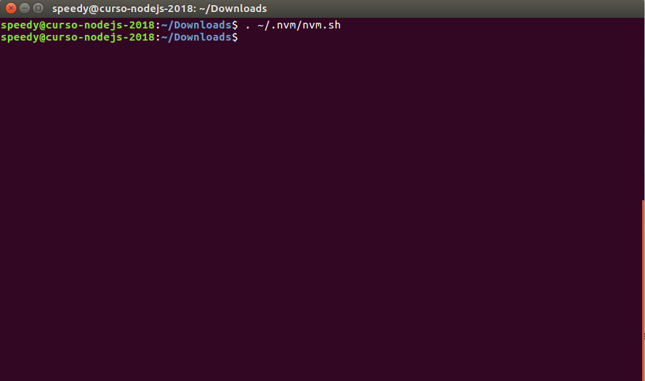
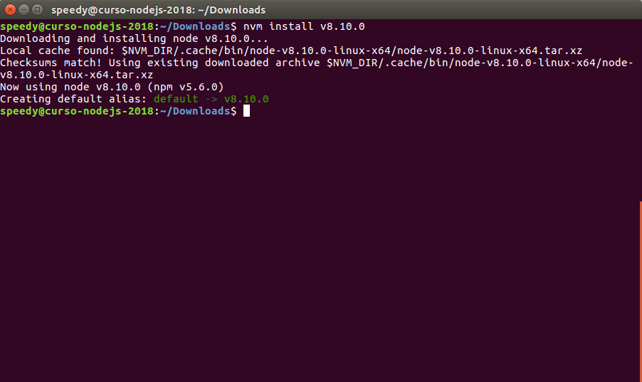
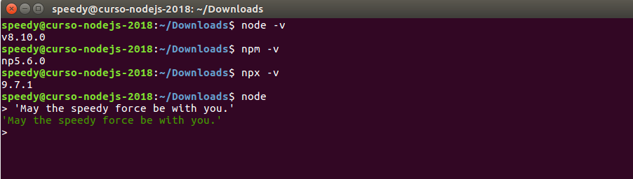

Para maiores informações você pode acessar o repósitorio deles[[02]](https://github.com/creationix/nvm).

### nvm-windows

O nvm-windows (*Node Version Management Windows*), é desenvolvido para o *Windows*.

Ele é bem simples e tem um instalador[[05]](https://github.com/coreybutler/nvm-windows/releases) que basta você baixar, executar e seguir os passos.


Após instalado, você pode acessar o `cmd` e executar o comando de *install* para instalar alguma versão.

```shell
nvm install latest
```

Você ira precisar ligar o `nvm` também:

```shell
nvm on
```

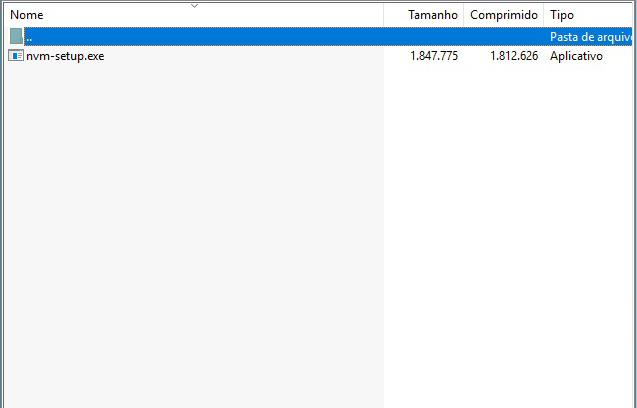
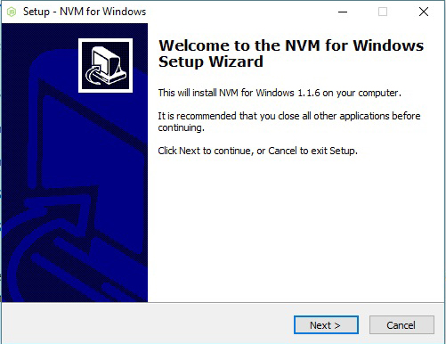
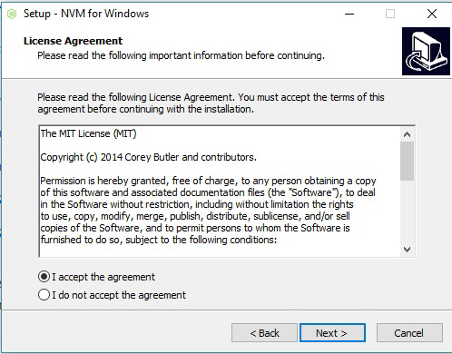
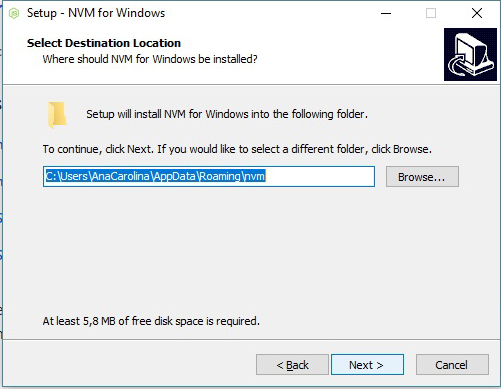
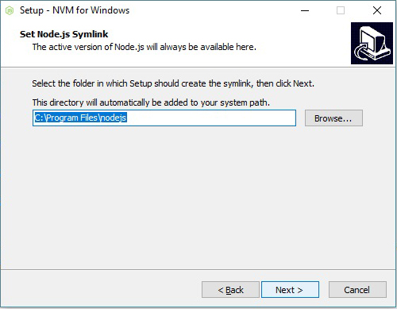
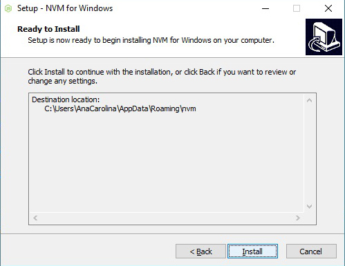
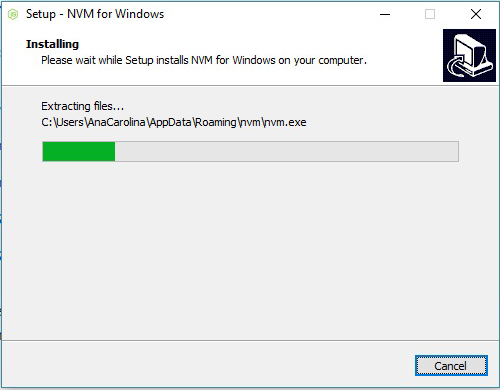
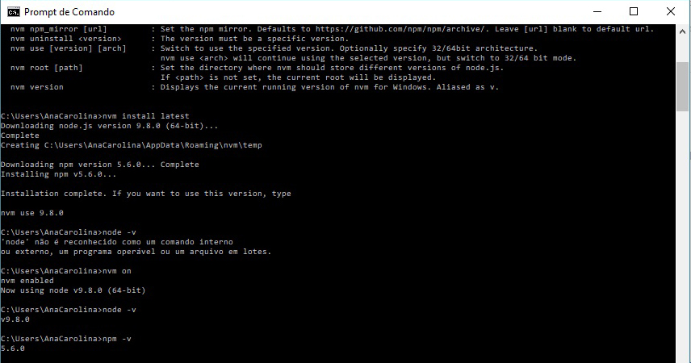

Para maiores informações você pode acessar o repósitorio deles[[03]](https://github.com/coreybutler/nvm-windows).

# Referência

<a id='ref-1'></a>
- [01] https://nodejs.org/en/download/
<a id='ref-2'></a>
- [02] https://github.com/creationix/nvm
<a id='ref-3'></a>
- [03] https://github.com/coreybutler/nvm-windows
<a id='ref-4'></a>
- [04] https://github.com/coreybutler/nvm-windows#this-is-not-the-same-thing-as-nvm-which-is-a-completely-separate-project-for-maclinux-only
<a id='ref-5'></a>
- [05] https://github.com/coreybutler/nvm-windows/releases
